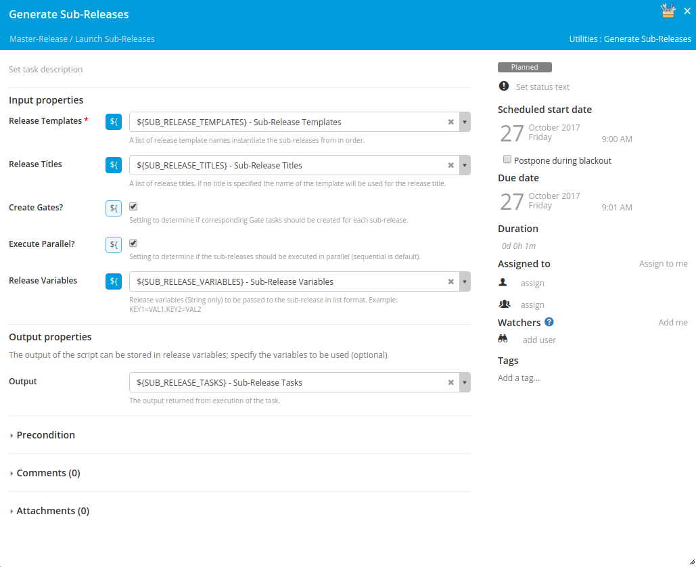

# xlr-utilities-plugin

[![License: MIT][xlr-utilities-plugin-license-image]][xlr-utilities-plugin-license-url]

[xlr-utilities-plugin-license-image]: https://img.shields.io/badge/License-MIT-yellow.svg
[xlr-utilities-plugin-license-url]: https://opensource.org/licenses/MIT
[xlr-utilities-plugin-downloads-image]: https://img.shields.io/github/downloads/xebialabs-community/xlr-utilities-plugin/total.svg

## Preface
This document describes the functionality provided by the xlr-utilities-plugin.

## Installation
Copy the plugin JAR file into the SERVER_HOME/plugins directory of XL Release.

## Overview
This plugin is intended to provide a variety of useful utility functionality for XL Release.
## Tasks
#### utilties.GenerateSubReleases
Task used to dynamically generate Sub-Releases.

###### Release Templates
The list of release templates used to create the sub-releases (required).
###### Release Titles
The list of release titles to be used when creating the sub-releases (optional). If none are provided the template title will be utilized.
###### Create Gates
Boolean parameter determining whether a gate task will be created for each sub-release that is spawned.
###### Parallel
Boolean parameter determining whether or not the spawned sub-releases will be run in parallel.
###### Release Variables
The release variables that should be passed to each sub-release. Currently, only String variables are supported. The list should be in the following format:
`KEY1=VAL1,KEY2=VAL2`
